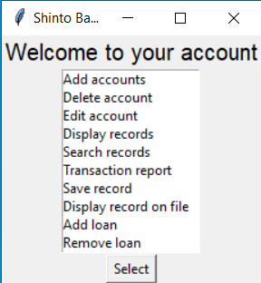
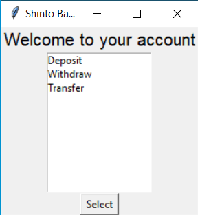
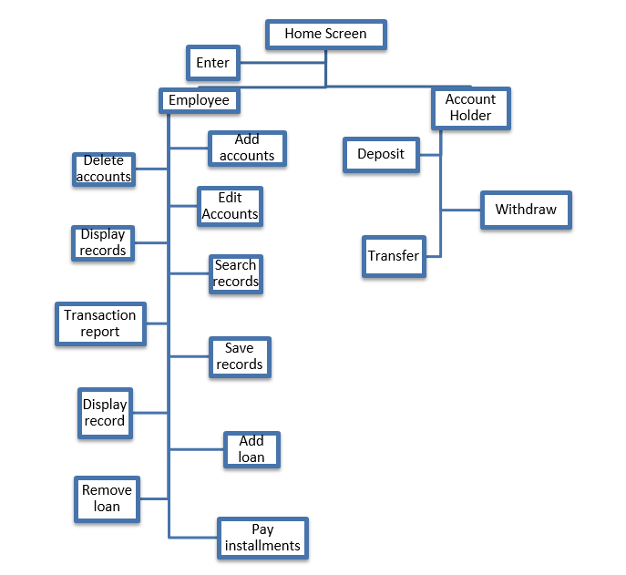

<h1>Bank Management System</h1>

The project is a python program which is used to manage the internal workings of the bank and uses MySQL to store the data of the clients and employees.

 
 
 
 
 
 

<h2> Functionality of the Application </h2>

The customer can use the bank management system to deposit and withdraw money from their account, apply for a loan and transfer money into an account via their account number. The employee can login into their account and setup accounts for customers check the transactions which are conducted in the bank and repay of loan.

<h2>Backend of Application</h2>

The MySQL server is used to retrieve and use the information taken from the input in python. The mysql_connector module in python is used to transfer data to the server. There are four tables accountholder, admin, loan and transaction. These tables contain the information used to enter an account, create a transaction report and the loans which are due.

